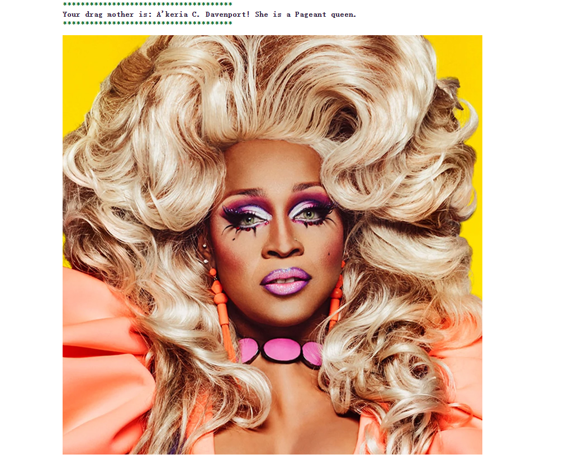
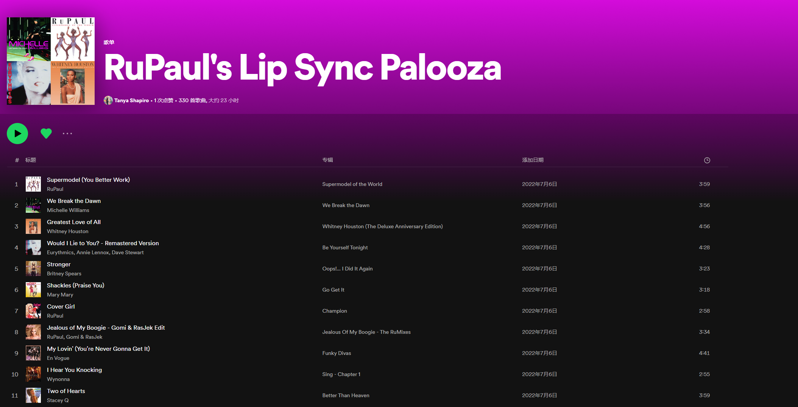

# :checkered_flag: Drag Race

## About
This project is dedicated to collecting, organising, and analysing information about [RuPaul's Drag Race](https://en.wikipedia.org/wiki/RuPaul%27s_Drag_Race) and related franchises (e.g. [RuPaul's All Stars](https://en.wikipedia.org/wiki/RuPaul%27s_Drag_Race_All_Stars), [Canada's Drag Race](https://en.wikipedia.org/wiki/Canada%27s_Drag_Race), [RuPaul's Drag Race UK](https://en.wikipedia.org/wiki/RuPaul%27s_Drag_Race_UK)). Data collection and data cleaning are performed using R.

Excerpts about Drag Race from [Wikipedia](https://en.wikipedia.org/wiki/Drag_Race_(franchise)):

>RuPaul's Drag Race, and Drag Race variants, is a television drag queen competition franchise created by American drag entertainer RuPaul, and the production company World of Wonder. It originated in the United States with RuPaul's Drag Race in 2009, where it was devised as a replacement for Rick & Steve: The Happiest Gay Couple in All the World (2007–2009). The show's aim is to find the next "Drag Superstar" who possesses the traits of "charisma", "uniqueness", "nerve" and "talent". RuPaul stated that the show looks for an entertainer who can stand out from the rest. RuPaul’s Drag Race is often credited for bringing drag into the "mainstream" media.

### Data Per Franchise

Below details the most recent updates per franchise. Datasets will be refreshed once new seasons are completed.

| Name                                        |   Region                  | Seasons | Note                                                 |
|:--------------------------------------------|:--------------------------|---------|:-----------------------------------------------------|
|   RuPaul's Drag Race                        |   United States           |   1-14  |                                                      |
|   RuPaul's Drag Race All Stars              |   United States           |   1-7   | S7 in progress, data incomplete |
|   The Switch Drag Race                      |   Chile                   | 2       | Excl. episodes, outcomes, lip syncs                  |
|   Drag Race Thailand                        |   Thailand                |   1-2   |                                                      |
|   RuPaul's Drag Race UK                     |   United Kingdom          |   1-3   |                                                      |
|   Canada's Drag Race                        |   Canada                  |   1-2   |                                                      |
|   Drag Race Holland                         |   Netherlands             |   1-2   |                                                      |
|   RuPaul's Drag Race Down Under             |   Australia, New Zealand  |   1     |                                                      |
|   Drag Race España                          |   Spain                   |   1-2   |                                                      |
|   Drag Race Italia                          |   Italy                   |   1     |                                                      |
|   RuPaul's Drag Race: UK vs the World       |   Global                  |   1     |                                                      |
|   Drag Race France                          |   France                  | 1       | S1 in progress, data incomplete |
|   Drag Race Philippines                     |   Philippines             |   -     | Not yet aired, no data     |
|   Canada's Drag Race: Canada vs. the World  |   Global                  |   -     | Not yet aired, no data   |
|   Drag Race Belgique                        |   Belgium                 | -       | Not yet aired, no data   |
|   Drag Race Sverige                         |   Sweden                  | -       | Not yet aired, no data    |

## Find your drag mother
This application is to help you find your drag mother among all contestants listed in the database. After answering a few questions, you will be either adopted by a 'Queen of the people' (AKA a drag queen who has won the Miss Congeniality) or by a 'Crowning Queen' (AKA all contestants who have had a top-3 finish in any season available in the database).

### Now start your engine and may the best woman win!

## Drag name creator
Shakespeare once said: 
> A rose by any other name would smell as sweet.

But when it comes to drag business, a name is truly important. 
With drag, your name should be: 
1. Memorable
2. About you

This application helps you find your drag name based on the drag mother who just adopted you. But alternatively, you will also get a drag name based on your full name. 

## Lip sync Spotify look-up
This application collects all the lip sync songs competed in Rupaul's Drag Race herstory. It will ask your music preference and recommend you a lip sync song to your liking. 
The original song list comes from an existing playlist on Spotify: [RuPaul Lip Syncs Playlist](https://open.spotify.com/playlist/49xR85Shg0IuVS9xkcfNm6)

### Now it's time for you to lip sync FOR YOUR LIFE! Good luck and don't fk it up!

## Special Thanks 
This project is based on the raw datasets available on tashapiro's repo [Drag Race](https://github.com/tashapiro/drag-race).
Special thanks to tashapiro's love as a fan and as a fan myself too, it was a blast working with the datasets.   
